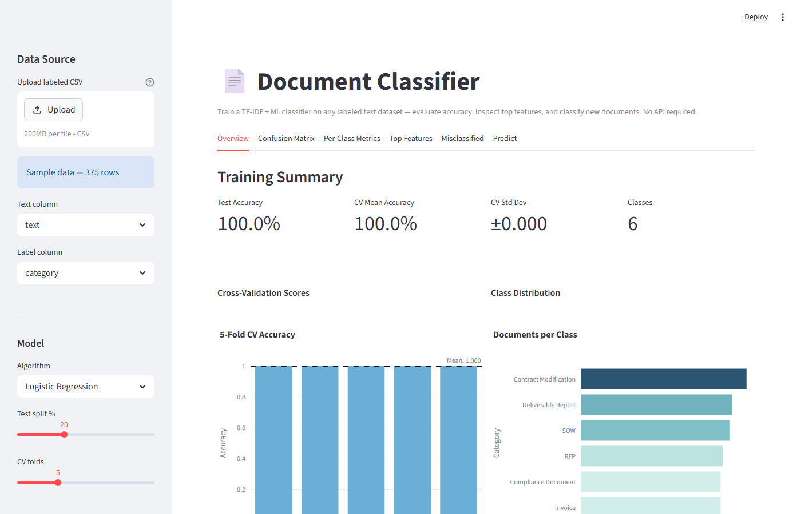
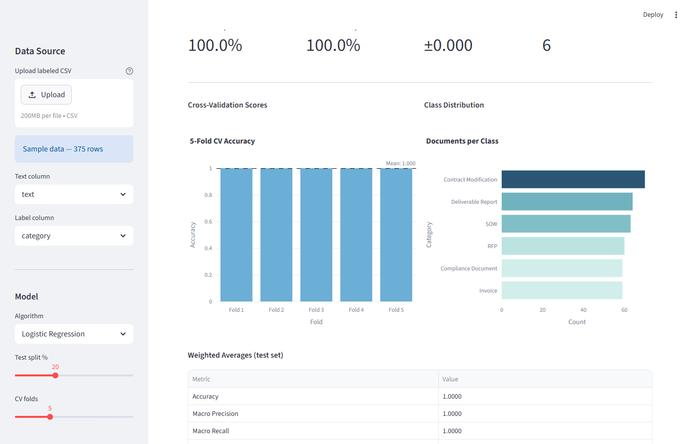
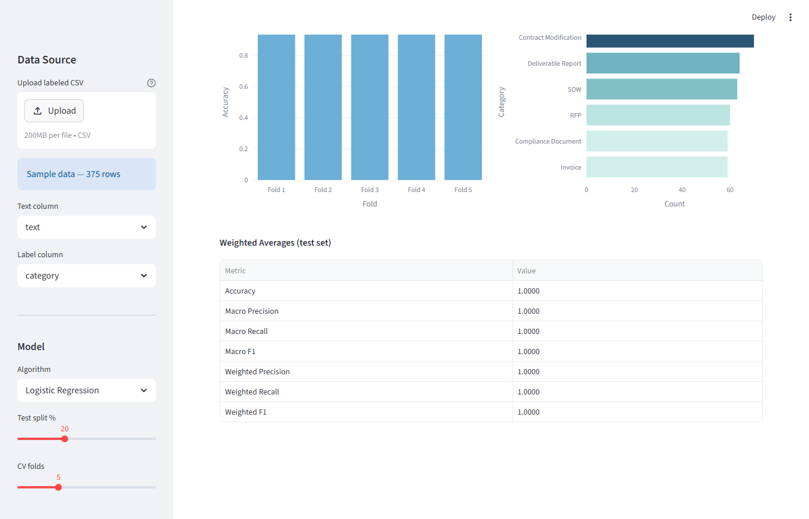

# Document Classifier


A Streamlit application that trains a TF-IDF + scikit-learn classifier on any labeled text dataset, evaluates it with cross-validation and a confusion matrix, and classifies new free-text in real time.

---

## Overview

Upload a CSV with a text column and a label column, select an algorithm and TF-IDF parameters, and click Train. The application fits a pipeline on a stratified train/test split, runs K-fold cross-validation, and presents results across six tabs: training summary metrics, an annotated confusion matrix, per-class precision/recall/F1, top discriminative terms per class (Logistic Regression only), a misclassified document table, and a live prediction panel. No API key required — all computation is local scikit-learn.

---

## Business Problem

Organizations that process large volumes of similar documents — contracts, invoices, compliance filings, support tickets, legal briefs — often need to route or triage them by type. Training a custom classifier on a labeled sample lets a team automate that categorization without a large language model or external service. This tool makes the train-evaluate-predict cycle accessible through a UI, with enough diagnostic output (confusion matrix, feature weights, misclassified documents) to judge whether the model is ready for use.

---

## Real-World Applications

| Domain | Use Case |
|---|---|
| Government contracting | Classify incoming submissions as RFP, SOW, Contract Modification, Invoice, or Deliverable Report — and route each to the correct review queue automatically |
| Procurement operations | Screen vendor documents by type before entry into an ERP system, reducing manual data-entry overhead |
| Legal services | Categorize case documents (pleadings, motions, discovery, correspondence) to support matter management and billing workflows |
| Financial operations | Distinguish invoice types, expense reports, and reconciliation documents for automated processing and exception flagging |
| Customer support | Route incoming tickets to the appropriate team (billing, technical, returns, general inquiry) based on message content |
| Regulatory compliance | Tag submissions and filings by regulation type or audit category for compliance tracking dashboards |
| Human resources | Sort inbound HR documents — offer letters, NDAs, benefit enrollments, performance reviews — into correct file locations |
| Government records management | Classify archived records by document type to support retention scheduling and Freedom of Information Act responses |

Any organization with a labeled sample of its own documents can substitute the included dataset with its own CSV and train a custom classifier in minutes.

---

## Machine Learning Workflow

The end-to-end pipeline runs in six stages:

1. **Document ingestion** — Upload a CSV containing a text column and a label column. The app loads the file and extracts the selected columns.
2. **TF-IDF vectorization** — Each document is converted to a numeric feature vector. Term frequency is scaled logarithmically (`sublinear_tf=True`), bigrams are included, and common English stop words are removed. The vocabulary is capped at 10,000 features to keep the model tractable.
3. **Label encoding** — String class labels are mapped to integers via `LabelEncoder` so the classifier can process them. Predictions are decoded back to class names before display.
4. **Model training** — A scikit-learn `Pipeline` wraps the TF-IDF vectorizer and the selected classifier (Logistic Regression or Multinomial Naive Bayes) into a single estimable unit. The pipeline is fit on a stratified train split (default 80%).
5. **Cross-validation** — Stratified K-fold CV runs across the full dataset (default 5 folds), producing per-fold accuracy scores and a mean ± std dev summary that gives a more stable estimate of generalization performance than the test-set accuracy alone.
6. **Prediction and evaluation** — On the test split, the pipeline produces class predictions. `predict_proba` is available for Logistic Regression, yielding per-class confidence scores. Evaluation outputs include test accuracy, a confusion matrix, per-class precision/recall/F1, top discriminative terms (Logistic Regression), and a table of misclassified documents.

---

## How It Works

1. The CSV is loaded; the selected text and label columns are extracted.
2. `src/vectorizer.py:build_tfidf()` constructs a `TfidfVectorizer` (sublinear TF scaling, English stop words, unigrams and bigrams by default, up to 10,000 features).
3. `src/classifier.py:train()` encodes labels with `LabelEncoder`, splits data with `train_test_split` (stratified by label), builds a `Pipeline([("tfidf", ...), ("clf", ...)])`, fits it on the training split, evaluates on the test split, and runs `cross_val_score` with `StratifiedKFold` on the full dataset.
4. Results are returned in a `TrainResult` dataclass containing the fitted pipeline, label encoder, class list, encoded predictions, accuracy metrics, CV scores, and feature names.
5. `src/metrics.py` computes the confusion matrix DataFrame, per-class precision/recall/F1 report, summary statistics, and the misclassified document table.
6. `predict_single()` calls `pipeline.predict()` and, for Logistic Regression, `pipeline.predict_proba()` to return the predicted label and per-class probabilities for a new text string.
7. `top_features_per_class()` extracts Logistic Regression coefficient weights per class and ranks the top-N most discriminative terms.

**Supported algorithms:**

| Algorithm | Notes |
|---|---|
| Logistic Regression | `max_iter=1000`, `C=1.0`, `solver="lbfgs"`; supports `predict_proba` and feature weight extraction |
| Multinomial Naive Bayes | `alpha=0.1`; supports `predict_proba`; feature weight extraction not available |

---

## Key Features

| Feature | Details |
|---|---|
| Overview tab | Test accuracy, CV mean accuracy, CV std dev, class count; per-fold CV bar chart; class distribution chart; weighted-average metrics table |
| Confusion Matrix tab | Plotly annotated heatmap (actual × predicted); raw matrix in expander |
| Per-Class Metrics tab | Precision, recall, F1, and support per class as a table and grouped bar chart |
| Top Features tab | Logistic Regression coefficient weights per class rendered as horizontal bar charts; multiselect to choose which classes to display |
| Misclassified tab | Table of documents the model got wrong, with actual vs. predicted labels; filterable by actual class; error rate metric |
| Predict tab | Free-text input with sample presets; returns predicted class and a class-probability bar chart |
| Configurable pipeline | Algorithm, test split %, CV folds, n-gram range, vocabulary size, and min document frequency all adjustable in the sidebar |

---

## Tech Stack

| Component | Version |
|---|---|
| Python | 3.11+ |
| Streamlit | ≥ 1.35.0 |
| scikit-learn | ≥ 1.4.0 |
| pandas | ≥ 2.0.0 |
| numpy | ≥ 1.26.0 |
| Plotly | ≥ 5.20.0 |
| pytest | ≥ 8.0.0 |

---

## Skills Demonstrated

| Skill | Implementation |
|---|---|
| Supervised classification | Logistic Regression and Multinomial Naive Bayes via sklearn Pipeline |
| TF-IDF feature engineering | Sublinear TF scaling, bigrams, stop word removal, vocabulary capping |
| Model evaluation | Stratified K-fold CV, confusion matrix, per-class precision/recall/F1 |
| Coefficient interpretation | Logistic Regression feature weight extraction and ranked visualization |
| Error analysis | Misclassified document table with actual vs. predicted labels |
| Streamlit UI | Multi-tab dashboard with configurable sidebar hyperparameters |
| Unit testing | 52 tests covering training pipeline, metrics, and edge cases |

---

## Project Structure

```
doc-classifier/
├── .github/
│   └── workflows/
│       └── tests.yml                  # CI — runs pytest on every push
├── .streamlit/
│   └── config.toml                    # Light theme; telemetry disabled
├── app/
│   └── main.py                        # Streamlit entry point; all UI and tab logic
├── data/
│   └── sample/
│       └── labeled_documents.csv      # ~380-row labeled contract document sample
├── docs/
│   ├── ARCHITECTURE.md                # Module design, Pipeline pattern, TrainResult schema, CV methodology
│   ├── DATA_DICTIONARY.md             # Output schemas for all public functions
│   ├── ENGINEERING_DECISIONS.md       # Six engineering decisions with alternatives and rationale
│   ├── MODEL_CARD.md                  # Algorithms, evaluation methodology, limitations, use cases
│   └── TESTING.md                     # Test corpus design, per-class inventory, coverage notes
├── scripts/
│   └── generate_sample_data.py        # Regenerates the sample CSV
├── screenshots/
│   ├── 01_overview.png                # Training summary and CV results
│   ├── 02_core_feature.png            # Confusion matrix and per-class metrics
│   └── 03_results.png                 # Top features and prediction panel
├── src/
│   ├── __init__.py                    # Public API (11 exports)
│   ├── vectorizer.py                  # build_tfidf(), encode_labels(), decode_labels()
│   ├── classifier.py                  # train(), predict_single(),
│   │                                  #   top_features_per_class(), TrainResult dataclass
│   └── metrics.py                     # confusion_matrix_df(), per_class_report(),
│                                      #   summary_stats(), misclassified_df()
├── tests/
│   ├── test_classifier.py             # 26 unit tests for classifier.py
│   └── test_metrics.py                # 26 unit tests for metrics.py
├── CHANGELOG.md
├── LICENSE
├── README.md
└── requirements.txt
```

---

## Installation

```bash
git clone https://github.com/RichieGarafola/doc-classifier.git
cd doc-classifier
python -m venv .venv

# Windows
.venv\Scripts\activate
# macOS / Linux
source .venv/bin/activate

pip install -r requirements.txt
```

---

## Usage

```bash
streamlit run app/main.py
```

The dashboard opens at `http://localhost:8501`.

**Training on your own data:**

1. Prepare a CSV with at least two columns: one containing the document text and one containing the class label.
2. Upload the file using the sidebar uploader.
3. Select the text column and the label column.
4. Choose an algorithm, set the test split percentage and CV folds.
5. Adjust TF-IDF parameters if needed (n-gram range, vocabulary size, min document frequency).
6. Click **Train Model**.

**Classifying a new document:**

After training, go to the Predict tab. Type or paste text into the input box (or select a sample preset) and click **Classify**. The predicted class and per-class probabilities are displayed immediately.

**Regenerating the sample data:**

```bash
python scripts/generate_sample_data.py
```

---

## Sample Data

`data/sample/labeled_documents.csv` — approximately 380 synthetic labeled contract documents across six categories.

| Column | Description |
|---|---|
| `doc_id` | Unique document identifier (DOC-0001 …) |
| `category` | One of: RFP, SOW, Contract Modification, Invoice, Deliverable Report, Compliance Document |
| `text` | Free-text document content assembled from category-specific phrases |

Each document contains 3–5 phrases drawn from a category-specific phrase pool, with connectors ("as required by the contract", "per the approved project plan") added for variation. The vocabulary is sufficiently distinct across categories that both supported algorithms train to high accuracy on this sample.

---

## Testing

```bash
pytest tests/ -v
```

The test suite covers:

- **test_classifier.py** — `build_pipeline` valid and invalid algorithm handling; `train` return type, class list, accuracy bounds, CV score length and mean, feature names, prediction array length and valid class indices, pipeline is fitted and callable after training; `predict_single` return type, valid predicted label, probabilities summing to 1.0, correct probability keys; `top_features_per_class` column schema, top-N cap per class, rank-starts-at-1, empty schema for Naive Bayes
- **test_metrics.py** — `confusion_matrix_df` shape, perfect-diagonal check, row/column label prefixes, off-diagonal non-zero for imperfect predictions, row sums equal support; `per_class_report` column schema, one row per class, perfect scores for perfect predictions, scores in [0, 1]; `summary_stats` required keys, perfect accuracy, all values in [0, 1], binary accuracy calculation; `misclassified_df` column schema, empty DataFrame for perfect predictions, correct misclassified count, actual/predicted values are valid class names, long text truncation

---

## Screenshots

| Overview | Core Feature | Results |
|---|---|---|
|  |  |  |
| Training summary and CV results | Confusion matrix and per-class metrics | Top features and prediction panel |

---

## Documentation

| Document | Description |
|---|---|
| [`docs/ARCHITECTURE.md`](docs/ARCHITECTURE.md) | Module map, sklearn Pipeline pattern, training flow, TrainResult dataclass schema, CV methodology, prediction flow, metrics module reference |
| [`docs/TESTING.md`](docs/TESTING.md) | Test corpus design, per-class inventory with assertion summaries, 52-test breakdown, CI integration |
| [`docs/DATA_DICTIONARY.md`](docs/DATA_DICTIONARY.md) | Output schemas for all public functions, TrainResult field types, sample CSV column spec |
| [`docs/MODEL_CARD.md`](docs/MODEL_CARD.md) | Algorithm descriptions, evaluation methodology, known limitations, recommended use cases, out-of-scope uses |
| [`docs/ENGINEERING_DECISIONS.md`](docs/ENGINEERING_DECISIONS.md) | Six engineering decisions with alternatives considered and rationale |

---

## Limitations

- **The model is retrained from scratch on each "Train Model" click.** There is no model persistence to disk. Closing the browser tab discards the trained pipeline.
- **Stratified splitting requires at least 2 examples per class.** Very small or imbalanced datasets may cause `train_test_split` to fail with a stratification error.
- **`min_df` defaults to 2.** Terms appearing in fewer than 2 documents are excluded. For very small datasets, setting `min_df` to 1 in the sidebar may be necessary to avoid an empty vocabulary.
- **Top Features is only available for Logistic Regression.** Multinomial Naive Bayes does not expose `coef_`, so the tab shows an info message instead of weights.
- **TF-IDF + linear classifiers work well on text with distinctive vocabulary per class.** If classes share most of their vocabulary and differ mainly in subtle phrasing or context, accuracy will be lower and a more expressive model (transformer-based, for example) may be needed.
- **The pipeline is not hyperparameter-tuned.** The default `C=1.0` for Logistic Regression and `alpha=0.1` for Naive Bayes are reasonable starting points but may not be optimal for every dataset.
- **Cross-validation is run on the full dataset**, meaning the test-set rows are included in the CV folds. For small datasets, test accuracy and CV mean accuracy may diverge noticeably.

---

## Future Enhancements

- Model export to disk (joblib) and reload on next session
- Hyperparameter grid search for C (Logistic Regression) and alpha (Naive Bayes)
- Support for additional algorithms (Linear SVC, Random Forest)
- Class imbalance handling (class weights, oversampling)
- SHAP values for per-prediction explainability
- Batch prediction: upload a CSV of unlabeled documents and download predictions

---

## License

MIT — see [LICENSE](LICENSE)
